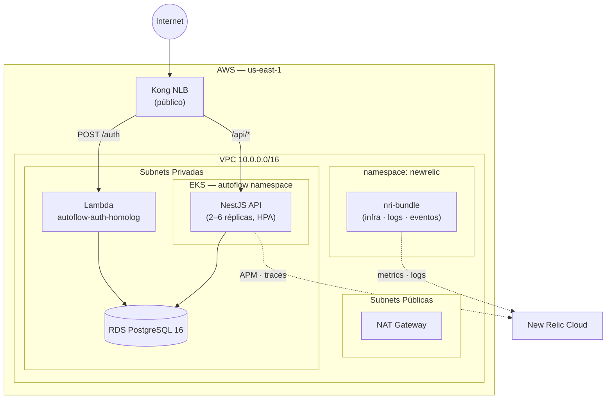

# fiap-tech-challenge-terraform-k8s

Infraestrutura Kubernetes do **AutoFlow** — provisiona VPC, EKS, Kong API Gateway,
New Relic e Security Groups via Terraform. É o **primeiro repo a ser deployado**
e fornece outputs (via S3 remote state) para todos os outros repos.

## Tecnologias

| Camada          | Tecnologia                              |
| --------------- | --------------------------------------- |
| Cloud           | AWS (EKS, VPC, NLB, Security Groups)    |
| IaC             | Terraform 1.7+                          |
| Kubernetes      | EKS 1.29                                |
| API Gateway     | Kong 2.38 (DB-less, Ingress Controller) |
| Observabilidade | New Relic nri-bundle 5.0                |
| CI/CD           | GitHub Actions                          |

## Arquitetura



## Posição no fluxo multi-repo

Este é o **primeiro repo a ser deployado**. Os outros repos leem seus outputs
do state S3 — nenhum valor de infra precisa ser copiado manualmente.

```
1. k8s  (este repo, Fase 1)  →  cria VPC, EKS, SGs, Kong, New Relic
2. db                        →  lê subnets + SG deste state, cria RDS
3. lambda                    →  lê subnets + SG deste state + DB do state db
4. k8s  (Fase 2, automático) →  lê function_name do state lambda, cria rotas Kong
5. codebase                  →  lê DB do state db, deploya no EKS
```

O state deste repo fica em:
`s3://fiap-tech-challenge-tfstate-fase3-matheus/k8s-infra/terraform.tfstate`

Outputs usados pelos outros repos:

| Output                     | Usado por         |
| -------------------------- | ----------------- |
| `private_subnet_ids`       | db, lambda        |
| `rds_security_group_id`    | db                |
| `lambda_security_group_id` | lambda            |
| `cluster_name`             | codebase          |
| `vpc_id`                   | db, lambda        |

## Estrutura

```
eks.tf               ← cluster EKS + node group (LabRole)
vpc.tf               ← VPC, subnets públicas/privadas, NAT gateway
kong.tf              ← Kong Helm release + rotas /auth e /api/*
newrelic.tf          ← New Relic nri-bundle (infra, logs, eventos)
newrelic_monitoring.tf ← dashboard + alert policy (Terraform)
security-groups.tf   ← SGs do RDS e da Lambda
k8s_secrets.tf       ← namespace autoflow + kubernetes_secret app-secrets (JWT)
outputs.tf           ← endpoints, IDs de SG e subnets
variables.tf         ← todas as variáveis com descrições
versions.tf          ← versões dos providers

environments/
  dev.tfvars         ← configuração de desenvolvimento
  staging.tfvars     ← configuração de homologação
  prod.tfvars        ← configuração de produção

scripts/
  bootstrap.sh       ← cria bucket S3 e gera backend.tf
  local-plan.sh      ← valida plano localmente
  local-apply.sh     ← aplica Fase 1 + Fase 2 localmente
  local-destroy.sh   ← destrói tudo localmente (com confirmação)
  set-github-secrets.sh ← configura secrets em todos os repos
```

## Observabilidade

O repo provisiona monitoramento completo via New Relic:

| Recurso                  | Descrição                                                                                       |
| ------------------------ | ----------------------------------------------------------------------------------------------- |
| `nri-bundle`             | Coleta métricas K8s, logs e eventos (Fluent Bit)                                                |
| `newrelic_one_dashboard` | Dashboard com 4 páginas: Ordens de Serviço, APIs & Performance, Kubernetes, Erros & Integrações |
| `newrelic_alert_policy`  | 5 condições: taxa de erros, latência P95, pod fora do ar, erros de integração, falhas em ordens |

Acesse os dashboards em **[one.newrelic.com](https://one.newrelic.com)** após o deploy.

### Alertas configurados

| Condição                             | Warning  | Critical | Janela |
| ------------------------------------ | -------- | -------- | ------ |
| Taxa de Erros HTTP (`autoflow-tc`)   | > 1%     | > 5%     | 5 min  |
| Latência P95 (`autoflow-tc`)         | > 1000ms | > 2000ms | 5 min  |
| Pods fora do ar (namespace autoflow) | —        | > 0      | 2 min  |
| Erros de integração externa          | > 0      | > 5      | 5 min  |
| Falhas em ordens de serviço          | > 1      | > 3      | 5 min  |

## Configurar secrets no GitHub

O script `scripts/set-github-secrets.sh` configura os secrets em **todos os 4 repos** e gera o `.env.local` para uso local — tudo a partir do mesmo `secret.env`.

| Modo | O que faz |
|------|-----------|
| `setup` | Seta todos os secrets nos 4 repos + gera `.env.local` |
| `refresh` | Renova credenciais AWS nos 4 repos + atualiza `.env.local` |
| `local` | Só gera/atualiza `.env.local`, sem tocar no GitHub |

### Primeira vez (setup completo)

```bash
# Pré-requisito: gh auth login
cp secret.env.example secret.env
# edite secret.env com todos os valores
./scripts/set-github-secrets.sh setup
# → GitHub secrets setados + .env.local gerado automaticamente
```

### Renovar credenciais AWS (~4h)

Cole as novas credenciais do painel AWS Academy no `secret.env` e execute:

```bash
./scripts/set-github-secrets.sh refresh
# → Atualiza AWS_ACCESS_KEY_ID, AWS_SECRET_ACCESS_KEY, AWS_SESSION_TOKEN
#   nos 4 repos E no .env.local em um único comando
```

### Só atualizar .env.local (sem GitHub)

```bash
./scripts/set-github-secrets.sh local
source .env.local
```

## Secrets por repo

| Secret                  | Descrição                                         |
| ----------------------- | ------------------------------------------------- |
| `AWS_ACCESS_KEY_ID`     | Credencial AWS Lab                                |
| `AWS_SECRET_ACCESS_KEY` | Credencial AWS Lab                                |
| `AWS_SESSION_TOKEN`     | Session token (obrigatório no Lab, expira em ~4h) |
| `NEWRELIC_LICENSE_KEY`  | Chave de ingest do New Relic (licença)            |
| `NEWRELIC_ACCOUNT_ID`   | ID numérico da conta New Relic                    |
| `NEWRELIC_API_KEY`      | User API Key (`NRAK-...`) para Terraform          |

> `lambda_function_name` não é um secret — é lido automaticamente do state S3
> do repo lambda durante o deploy.

## CI/CD

| Evento                | Comportamento                                         |
| --------------------- | ----------------------------------------------------- |
| PR para `main`        | `terraform fmt` + `validate` + `plan`                 |
| PR para `develop`     | `terraform fmt` + `validate` + `plan` (staging vars)  |
| Merge em `main`       | Deploy completo (Fase 1 + Fase 2) com `prod.tfvars`   |
| Push em `develop`     | Deploy completo com `staging.tfvars`                  |

## Subir localmente

### 1. Pré-requisitos

```bash
# Instalar: terraform, aws cli, kubectl, jq
terraform version   # >= 1.7
aws --version
kubectl version --client
jq --version
```

### 2. Credenciais AWS Lab

Copie as credenciais do painel do AWS Academy:

```bash
cp .env.local.example .env.local
# edite .env.local com AWS_ACCESS_KEY_ID, AWS_SECRET_ACCESS_KEY, AWS_SESSION_TOKEN
# e as chaves New Relic (license key, account id, api key)
source .env.local
```

### 3. Fase 1 — infra base (~15 min)

```bash
./scripts/local-apply.sh environments/dev.tfvars
```

Isso executa automaticamente:
- `bootstrap.sh` (cria bucket S3, gera `backend.tf`)
- `terraform init`
- `terraform apply` com targets de Fase 1 (VPC, EKS, SGs, Kong, New Relic, namespaces, JWT secret)
- `aws eks update-kubeconfig`
- `terraform apply` completo (Fase 2 — rotas Kong, lê lambda function name do S3)

### 4. Verificar

```bash
kubectl get nodes
kubectl get pods -n kong
kubectl get pods -n newrelic
kubectl get svc -n kong kong-kong-proxy \
  -o jsonpath='{.status.loadBalancer.ingress[0].hostname}'
```

### 5. Validar sem aplicar

```bash
./scripts/local-plan.sh environments/dev.tfvars
```

### 6. Destruir

```bash
# Destrói a infra
./scripts/local-destroy.sh

# Destrói a infra E remove o bucket S3 de state (apaga states de todos os repos)
./scripts/local-destroy.sh --purge-bucket
```

O script pede confirmação digitando `destroy` antes de executar.

## Observações AWS Lab

- O lab bloqueia `iam:CreateRole` e `iam:CreateOpenIDConnectProvider`
- Todos os recursos usam a `LabRole` existente (`enable_irsa = false`)
- O session token expira em ~4h — atualize as credenciais antes de cada deploy
- `backend.tf` é gerado pelo `bootstrap.sh` e está no `.gitignore`

## Autores

- João Miguel
- Kaike Falcão
- Matheus Hurtado
- Thalita Silva
